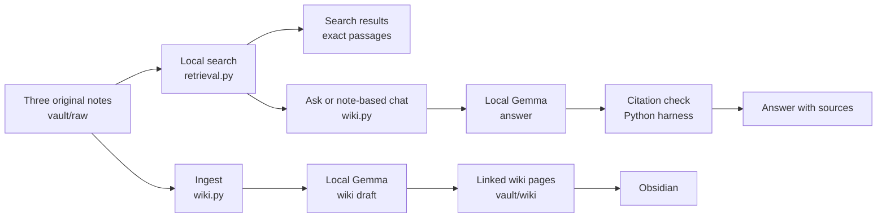
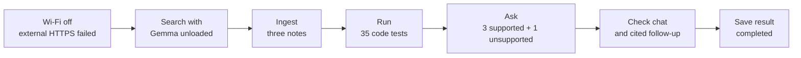

# Personal Wiki with Local Gemma + RAG


This is Assignment 4 for Fundamentals of Agentic AI.

- **Goal:** Build a personal wiki from three notes.
- **Model:** Run `gemma4:e2b-mlx` with local Ollama.
- **Interface:** Use our Python command-line interface (CLI).
- **Wiki:** Open `vault/` as a separate Obsidian vault.
- **Status:** The build and tests are complete. The repository is public.
- **Submission:** The [repository URL](https://github.com/patronofalltrades/Fundamentals-of-Agentic-AI-Local-LLM-Wiki) was submitted to bCourses Assignment 4 on 2026-09-28.

The title, `ask`, and `chat` images are AI-generated concept art. The test evidence and Obsidian screenshots are in [`evidence/`](evidence/).

## Find the important files

- [Implementation plan](IMPLEMENTATION_PLAN.md): the build steps and quiz points.
- [Learning checkpoints](learning/quiz-log.md): how I used a quiz to check my understanding.
- [Design notes](design.md): the roles of search, Gemma, and the harness.
- [Source catalog](data/source-catalog.json): the three approved notes and their hashes.
- [Wiki index](vault/index.md): links to the three wiki pages and three original notes.
- [Evaluation plan](evaluation/expectations.md): three answerable cases and one unsupported case.
- [Question and answer review](evidence/question-and-answer-review.md): exact test questions, displayed answers, chat replies, and assessment.
- [Offline result](evidence/offline/README.md): the disconnected test and safe GIF.
- [Obsidian screenshots](evidence/obsidian/README.md): the note, index, and graph views.
- [Submission handoff](SUBMISSION_HANDOFF.md): the final checklist.

## How I checked my learning

While I coded and prepared this assignment, I used short quiz questions to check that I understood each part. I answered in my own words and compared my answers with the CLI behavior and the original notes.

- I explained what retrieval finds and what Gemma does with a passage.
- I explained how the Python harness controls search, model calls, and citations.
- I checked why a valid citation ID does not prove that the cited text supports a claim.
- I explained why `ask` starts fresh while `chat` keeps context.
- The [implementation plan](IMPLEMENTATION_PLAN.md) marks the quiz points. The [learning log](learning/quiz-log.md) records the topics without sharing my private quiz conversation.

The quiz checked **my understanding**. The four `ask` cases in the [evaluation review](evidence/question-and-answer-review.md) checked **the wiki system**.

## How the system works

**Retrieval** finds a passage in the original notes. **RAG** means retrieval-augmented generation: Gemma uses that passage to write an answer. The **harness** is our Python code. It selects the command, calls search and Gemma, checks citations, and saves results.



- `search` returns original passages. It does not call Gemma.
- `ask` starts a new question. It uses retrieved passages and checks citation IDs.
- `chat` keeps recent turns in one session. It searches notes only when needed.
- `ingest` asks Gemma to draft a wiki page from one approved note.
- The search index never reads wiki pages, chat history, quizzes, or the answer key.
- The model endpoint is `127.0.0.1:11434`. The required path has no cloud fallback.

## Run the CLI

These commands use the folder path on Hanif's Mac. If you clone the repo elsewhere, use your clone folder.

1. Install Python 3.9 or later and Ollama. This code uses Python's standard library.
2. Check that `gemma4:e2b-mlx` is installed with `ollama list`. Open Ollama.
3. Open Terminal.
4. Go to the project folder.
5. Show the available commands.

```sh
cd "/Users/haniframadhan/Documents/ChatGPT/Fundamentals of Agentic AI project"
python3 wiki.py help
```

### Search original passages

```sh
python3 wiki.py search "max steps tokens" --limit 1
```

- The result gives the original text, source path, line range, and citation ID.
- `--limit 1` shows one passage.
- Search still works when Gemma is unloaded.
- See the [search guide](learning/search-walkthrough.md) and [search evidence](evidence/search/README.md).

### Ask for a cited answer


Replace `YOUR QUESTION` with a question of your own.

```sh
python3 wiki.py ask "YOUR QUESTION" --limit 3
```

- Each `ask` call starts without chat history.
- The harness retrieves original passages and sends them to local Gemma.
- The harness rejects a citation ID that was not retrieved.
- Gemma must say when the notes do not support an answer.
- A person must still check that each cited passage supports the claim.
- See the [ask guide](learning/ask-walkthrough.md), [case plan](evaluation/expectations.md), and [test result](evidence/offline/README.md).

### Chat and keep context


```sh
python3 wiki.py chat
```

- Type a message and press Return.
- Type `/exit` to end the session.
- A new `chat` command starts a new session.
- General brainstorming does not search the notes.
- A note-based turn searches the originals and cites its sources.
- A follow-up to a cited answer searches the original again.
- See the [chat guide](learning/chat-walkthrough.md) and [chat evidence](evidence/chat/README.md).

### Ingest an original note

```sh
python3 wiki.py ingest --source S01
```

- `S01` is the architecture note. `S02` and `S03` select the other notes.
- Use `--all` to draft all three pages.
- The harness checks each source hash before it sends text to Gemma.
- The harness copies cited evidence from the original note.
- The page plan sets stable file names and related-page links.
- The current pages are reviewed. The command above stops to protect S01.
- To replace that page, add `--replace-reviewed`. Then review the new draft again.
- See the [ingestion guide](learning/ingestion-walkthrough.md) and [ingestion evidence](evidence/ingestion/README.md).

### Run code checks

```sh
python3 -m unittest discover -s tests -v
```

- The 35 code tests use synthetic notes and model responses.
- The real Gemma runs and offline checks are separate.

## Check the assignment results

- **Sources:** Three approved study notes are in [`vault/raw/`](vault/raw/). Their hashes are in the [catalog](data/source-catalog.json).
- **Wiki:** Three reviewed pages are in [`vault/wiki/`](vault/wiki/). The [index](vault/index.md) links the pages and originals.
- **Ask:** Q1, Q2, and Q3 returned cited answers. Q4 was unsupported and returned an insufficient-evidence answer.
- **Chat:** A four-turn session and a cited note follow-up passed.
- **Search:** It returned original passages without model generation.
- **Obsidian:** The [open note](evidence/obsidian/open-note.png), [index](evidence/obsidian/index.png), and [graph](evidence/obsidian/graph.png) screenshots are saved.
- **Offline:** Two disconnected runs completed. The latest run passed ingestion, 35 code tests, four ask cases, and chat checks.

The [question and answer review](evidence/question-and-answer-review.md) shows the exact four test questions and displayed answers. The [connected report](evidence/connected-evaluation.md) and [offline report](evidence/offline/README.md) give run results.

## Offline proof

The offline script ran this sequence on 2026-09-28:



- The latest isolated ingestion took **34.08 seconds**.
- The four `ask` calls took **3.9, 2.9, 3.8, and 3.2 seconds**.
- Ollama reported **7.6 GB loaded on the GPU** after the checks. This is not peak application memory.
- The [prompt-free JSON summary](evidence/offline/completed-run-summary.json) records flags, timing, and hashes.
- The [offline evidence note](evidence/offline/README.md) explains the first failed attempt and the completed reruns.
- The full recordings and raw logs stay private. The GIF below shows safe Terminal views only.


To repeat the test on Hanif's Mac, read the [offline walkthrough](learning/offline-walkthrough.md). The script uses private test inputs that are not in this public repository. Other readers can ask their own questions about these notes. A different set of notes needs an updated source catalog.

## Open the wiki in Obsidian

1. Start Obsidian.
2. Select **Open folder as vault**.
3. Select the `vault/` folder in this repository.
4. Open [`index.md`](vault/index.md).
5. Follow a wiki-page link.
6. Follow a source-note link from that page.

- This vault is separate from Hanif's Brain.
- The old bookmark copies in Hanif's Brain were not changed.
- The approved assignment notes credit the posts that inspired them.
- Obsidian link syntax uses `[[Page Name]]`.
- The [screenshot guide](evidence/obsidian/README.md) shows the checked views.

## Files and privacy

- `vault/raw/`: the three approved original study notes.
- `vault/wiki/`: the three reviewed, linked wiki pages.
- `wiki.py`: the CLI and harness.
- `retrieval.py`: local passage search.
- `prompts/`: model instructions for the CLI.
- `evaluation/`: case roles, expected evidence, and test code.
- `learning/`: walkthroughs and quiz checkpoints.
- `evidence/`: public summaries, screenshots, and safe GIFs.
- `private-archive/` and raw run folders: Git-ignored local records.

The four test questions and displayed responses are public in the review linked above. Keep raw model records, full recordings, and other private prompts out of the public repo.

## Device and limits

- **Mac:** MacBook Air with an Apple M5 chip and 16 GB of unified memory.
- **Ollama:** Version 0.34.3.
- **Model:** `gemma4:e2b-mlx`, Gemma 4 E2B, `nvfp4` quantization, 7.5 GB download.
- **Runtime context:** 8,192 tokens in the offline test.
- **Search method:** SQLite FTS5 keyword search with stemming and BM25 ranking.
- **Limit:** A new paraphrase can miss a relevant passage. A search hit also does not prove that the note answers the question.
- **Next improvement:** Compare this search with a local embedding index on the same frozen cases.
- **Ingestion limit:** Large notes that exceed the input budget fail with an error. Chunked ingestion is future work.

References: [assignment brief](https://docs.google.com/document/d/1p9vRwgdT9cmSxwdl4ylHKi7dcBZFSmVpILcFMQS33Vs/edit), [Gemma guide](https://ai.google.dev/gemma/docs/core), [Ollama Gemma listing](https://ollama.com/library/gemma4), [Ollama chat API](https://docs.ollama.com/api/chat), [SQLite FTS5](https://www.sqlite.org/fts5.html), and [Obsidian vault guide](https://help.obsidian.md/Files%20and%20folders/Manage%20vaults).

## Course submission

This one URL was submitted to bCourses Assignment 4 on 2026-09-28:

**[github.com/patronofalltrades/Fundamentals-of-Agentic-AI-Local-LLM-Wiki](https://github.com/patronofalltrades/Fundamentals-of-Agentic-AI-Local-LLM-Wiki)**
