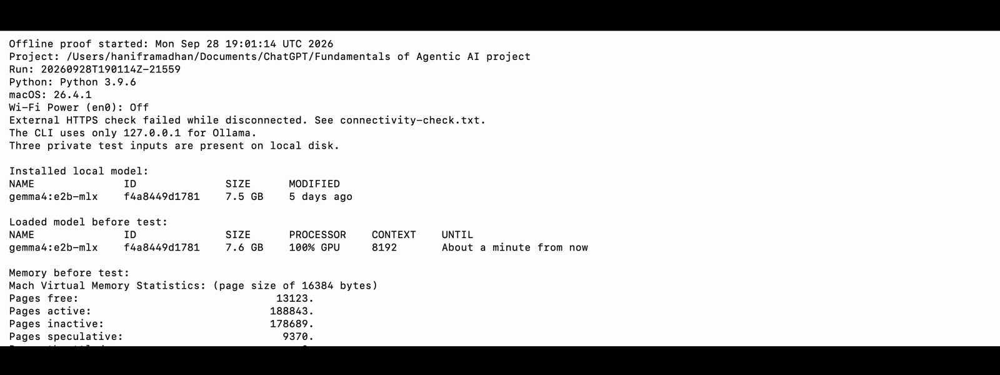

# Personal Wiki with Local Gemma + RAG


Assignment 4 for Fundamentals of Agentic AI. This repository documents the learning project. The [assignment brief](https://docs.google.com/document/d/1p9vRwgdT9cmSxwdl4ylHKi7dcBZFSmVpILcFMQS33Vs/edit) governs the final deliverable.

The title, `ask`, and `chat` illustrations are AI-generated concepts. Test records and Obsidian screenshots are in `evidence/`.

Read the [step-by-step implementation plan](IMPLEMENTATION_PLAN.md) for the build order, checks, and quiz points.

## Current status

The CLI has working `ingest`, `search`, `ask`, `chat`, and `help` commands. On 2026-09-27, we replaced the original bookmark copies with three rewritten study notes in the separate assignment Obsidian vault. Hanif approved their wording, and their hashes are frozen in the source catalog. Local Gemma generated three linked wiki pages, which were checked against the notes. The frozen corpus passed connected and disconnected four-case evaluations. The required Obsidian screenshots are saved. Two disconnected runs completed on 2026-09-28. This [public GitHub repository](https://github.com/patronofalltrades/Fundamentals-of-Agentic-AI-Local-LLM-Wiki) has the reviewed code and prompt-free evidence. The remaining handover step is to submit its URL in bCourses.

The [source catalog](data/source-catalog.json) records the approved notes, source links, and SHA-256 hashes. The [intake record](evidence/source-intake/README.md) explains the migration and review status. The full third-party bookmark copies remain only in a Git-ignored local archive and in Hanif's Brain. Exact evaluation inputs and raw logs stay local; the public report contains outcomes without question text.

## How the parts work together

Open `vault/` as a separate Obsidian vault to browse the original notes, linked wiki pages, and `index.md`. Run `wiki.py` from this repository's top folder in Terminal. Its CLI is the user interface; the Python harness reads the notes, uses `retrieval.py` to find original passages, calls local Ollama at `127.0.0.1:11434` for Gemma, checks citations, and saves results outside the vault. A direct `ollama run` chat can test Gemma, but it does not connect the model to these notes.

The target computer is a MacBook Air with an Apple M5 chip and 16 GB of unified memory. Ollama 0.34.3 and Obsidian are installed. `gemma4:e2b-mlx` is downloaded locally; Ollama reports Gemma 4 E2B, `nvfp4` quantization, a 131,072-token model context limit, and a 7.5 GB download. In the completed disconnected run, isolated ingestion of the three notes took 34.08 seconds. The four `ask` calls took 3.9, 2.9, 3.8, and 3.2 seconds of wall time. After the checks, Ollama reported the model loaded at 7.6 GB, 100% GPU, with an 8,192-token runtime context. This is a loaded-model snapshot, not peak application memory. The [official Gemma guide](https://ai.google.dev/gemma/docs/core) explains the model-size tradeoffs, and [Ollama's Gemma 4 listing](https://ollama.com/library/gemma4) identifies the runtime model.

## Run local ingestion

Start with the [guided terminal walkthrough](learning/ingestion-walkthrough.md). Read the [ingestion results](evidence/ingestion/README.md) for actual outcomes and corrections.

Use Python 3.9 or later and the installed Ollama model. This command uses only Python's standard library. Open Ollama before running it.

```sh
cd "/Users/haniframadhan/Documents/ChatGPT/Fundamentals of Agentic AI project"
python3 wiki.py help
python3 wiki.py ingest --source S01
```

`S01` selects the architecture note. `S02` selects versioned agent learning. `S03` selects run controls. Use `--source S02 S03` for the other two, or `--all` for all three.

The command checks source hashes, sends the original to local Gemma, validates passage IDs and copies exact evidence from the original, writes a draft to `vault/wiki/`, and updates `vault/index.md`. The [prompt](prompts/ingest.txt) controls the drafting task. The [page plan](data/wiki-plan.json) supplies stable titles and related links. Model-generated text does not choose file paths.

Every model attempt has a folder under `evidence/ingestion/` with its request, response, timing, model identity, and outcome. Ollama's loaded-model memory snapshot is not peak process memory. These connected runs do not count as offline proof. The API contract follows the [Ollama chat reference](https://docs.ollama.com/api/chat) and [structured-output guide](https://docs.ollama.com/capabilities/structured-outputs).

Read each draft against its original before marking it reviewed. A repeat run updates the same page and archives the prior page in its run folder. A reviewed page is protected: replacing it requires `--replace-reviewed`, and the replacement is a new draft that needs review again. Larger notes that exceed the conservative input budget fail with a clear error; chunked ingestion is not implemented yet.

```sh
python3 -m unittest discover -s tests -v
```

These tests use synthetic notes and mocked model responses. They check file integrity, evidence validation, repeat ingestion, reviewed-page protection, and failure handling. They do not replace the real model tests.

## Search the original notes

```sh
python3 wiki.py search "max steps tokens" --limit 1
python3 wiki.py search "unlimited resources" --limit 5
```

Search prints exact passages, source paths, line ranges, and stable citation IDs. It does not call Gemma. Use `--json` for full results and `--rebuild` to recreate the local index. Each successful search saves a record in `evidence/search/`.

The first search builds `runtime/search.db` from cataloged originals only. Each later search checks their hashes. A catalog or index-version change rebuilds the index. A changed original must be reviewed and frozen again before use. Generated wiki pages, quizzes, and evaluation answers are never search inputs.

The index uses SQLite FTS5 keyword search, English stemming, and BM25 ranking. The [SQLite FTS5 reference](https://www.sqlite.org/fts5.html) describes these mechanisms. A small, visible query expansion connects “architecture” to pattern names, “resources” to budgets, tokens, and memory, and “unlimited” to unbounded and budgets. The result JSON records the added terms. **Limit:** This is lexical search, so a new paraphrase may miss a relevant passage. Related results do not prove that a question is answerable. **Next improvement:** Compare it with a local embedding index using the same frozen questions before replacing the simple search.

See the [search walkthrough](learning/search-walkthrough.md) and [version-2 retrieval status](evidence/search/README.md). The old-corpus baseline and revised result are preserved in the local archive, not presented as evidence for the new notes.

## Ask from the notes


```sh
python3 wiki.py ask "$QUESTION" --limit 3
```

Set `QUESTION` to a question you want to ask before running this example.

`ask` starts with one new question and no chat history. It retrieves original passages, sends only those passages and the question to local Gemma, and checks that returned citation IDs belong to the retrieved set. It tells Gemma to abstain if the passages do not support every part of the question. A valid citation ID still needs a human check: the passage must support the answer's claim.

The direct test uses its top passage; the other cases use three. Each attempt saves the exact passages, model request and response, runtime settings, answer, and outcome in Git-ignored local records. See the [ask walkthrough](learning/ask-walkthrough.md), [public evaluation plan](evaluation/expectations.md), and [prompt-free connected results](evidence/connected-evaluation.md).

## Chat locally


```sh
python3 wiki.py chat
```

Type a message and press Return. Type `/exit` to finish. A chat session keeps recent turns for follow-ups. Generic brainstorming and drafting use plain text and do not search notes. If you ask about your notes, the harness retrieves original passages and checks the returned citation IDs. A follow-up that shortens a cited note answer retrieves again, so its source stays attached. Optional ideas are labeled `Suggestion:`. New chat sessions start with no history.

See the [chat walkthrough](learning/chat-walkthrough.md) and [version-2 chat status](evidence/chat/README.md). Connected and disconnected chat checks used the frozen source hashes.

## Run the offline proof

Read the [offline walkthrough](learning/offline-walkthrough.md) before disconnecting. First run `python3 scripts/prepare-offline-inputs.py` while online so the private test files are resident on local disk. In a new macOS Terminal window after turning Wi-Fi off and unplugging other network paths, run `bash scripts/offline-proof.sh`. It refuses to continue if Wi-Fi is on or an external HTTPS site is reachable. It records the network check and then runs search, isolated ingestion, code tests, four ask questions, and chat checks.

The [offline evidence note](evidence/offline/README.md) and [prompt-free result JSON](evidence/offline/completed-run-summary.json) report two completed disconnected runs. The latest passed search without a loaded model, ingestion of all three sources, 35 code tests, three cited answerable cases, one unsupported case, and chat checks. I checked the answer claims against the cited original lines. The 12.5-second GIF shows the safe Terminal steps; full recordings stay private and raw run files are Git-ignored. The first failed attempt is preserved in the evidence note.



## Build contract

- Keep at least three unchanged, publishable original notes in `vault/raw/`.
- Generate short, descriptive Markdown pages in `vault/wiki/`, review each against its original, connect related pages, and maintain `vault/index.md`.
- Build our own CLI and harness with `ingest`, `chat`, `ask`, `search`, and `help`.
- `search` returns original passages and paths without model generation. `ask` answers independently from retrieved evidence with checked citations or says the evidence is insufficient. `chat` keeps conversation context, retrieves only when useful, and labels suggestions.
- Keep source passages, wiki pages, prompts, evaluation expectations, and run outputs separate. Research retrieval must not index the answer key or generated chat history.
- Define three answerable questions and one unsupported question before running the evaluation. Record retrieval and generation separately.
- Restart and run ingestion, four ask tests, and chat/search checks while disconnected from the internet. Save actual outputs, timing, memory observations, and a terminal recording or screenshots.
- Open `vault/` in Obsidian and capture the required note, index/page-list, and graph screenshots. Check links and source references by opening them.
- Publish one public GitHub repository only after checking shareability, credentials, and signed-out access. Submit its URL through bCourses.

## Project folders

| Folder | Purpose |
| --- | --- |
| `vault/raw/` | Unchanged original notes. |
| `vault/wiki/` | Reviewed, linked wiki pages. |
| `vault/index.md` | The human start page. |
| `vault/attachments/` | Images used in wiki pages. |
| `evaluation/` | Prompt-free public case roles and evaluation scripts. Exact test inputs stay in Git-ignored local storage. The CLI must not search this folder. |
| `learning/` | Our quiz answers and corrections. The CLI must not search this folder. |
| `evidence/` | Actual test records, offline proof, and Obsidian screenshots. |

Obsidian reads a vault from a normal folder. Use **Open folder as vault** and select `vault/`, not the repository root. The assignment uses this separate vault. Open `index.md` to reach the three study notes and three reviewed wiki pages. Hanif's Brain remains separate. Obsidian supports links such as `[[Page Name]]`. The index-to-page and page-to-source links have been checked in the app. See the [Obsidian vault guide](https://help.obsidian.md/Files%20and%20folders/Manage%20vaults) and [internal link guide](https://help.obsidian.md/Linking%20notes%20and%20files/Internal%20links).

The required Obsidian views are [an open wiki page](evidence/obsidian/open-note.png), [the index](evidence/obsidian/index.png), and [the seven-file link graph](evidence/obsidian/graph.png). The [visual evidence notes](evidence/obsidian/README.md) list additional source and wiki-page screenshots.

## Learning checkpoints

We will pause at each checkpoint to answer a short quiz and test the answer against the implementation:

1. Explain the retrieval tool, RAG workflow, and harness.
2. Trace `search`, `ask`, and `chat` through the code and predict their different outputs.
3. Diagnose a failed retrieval separately from an unsupported generated claim.
4. Explain why an offline restart is stronger evidence than a cached online result.

The answers belong in `learning/quiz-log.md`, outside the searchable wiki. The quiz is part of our learning process, not a substitute for the assignment's four required ask-mode tests.

## Selected notes and next step

1. Choosing Agent Architectures — compare agent structures.
2. Versioned Agent Learning — evaluate, keep or revert, and record learning.
3. Agent Run Controls — explain budgets and recovery.

The retrieval, citation, and chat learning checkpoints are in `learning/quiz-log.md`. Ingestion, search, ask, and chat are implemented. The frozen corpus has passed connected and disconnected answer and chat checks. Public visibility and unauthenticated access to the README and completed-run GIF were checked. Submit the repository URL in bCourses.
