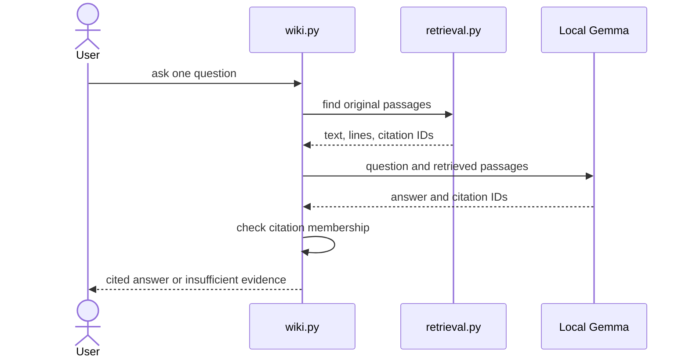

# How the wiki works

This document explains the code and its limits. The [README](README.md) gives the commands.

## Inputs and outputs

- **Originals:** Three Hanif-approved study notes in `vault/raw/`.
- **Source catalog:** `data/source-catalog.json` records each path and SHA-256 hash.
- **Wiki:** Three reviewed pages in `vault/wiki/`, linked from `vault/index.md`.
- **Model:** `gemma4:e2b-mlx` through local Ollama.
- **Harness:** Python code in `wiki.py` controls the workflow.
- **Search:** `retrieval.py` finds passages from the original notes.

| Command | Main job | Uses Gemma? | Uses chat history? |
| --- | --- | --- | --- |
| `search` | Show original passages | No | No |
| `ask` | Answer one question with citations | Yes | No |
| `chat` | Brainstorm or discuss the notes | Yes | Within one session |
| `ingest` | Draft a wiki page from an approved note | Yes | No |

The required model path uses `127.0.0.1:11434`. It has no cloud fallback.

## Ask flow

- `ask` starts a new request. It does not use past chat turns.
- Search returns text, a source path, a section, line numbers, and a citation ID.
- The harness checks that each cited ID belongs to a retrieved passage.
- This check does **not** prove that the passage supports the claim.
- A person checked the tested answers against the original lines.
- When evidence is missing, the answer must say so.

## Wiki ingestion

1. The harness reads one cataloged original note.
2. It checks the note's hash. A changed note stops the run.
3. It labels the source paragraphs.
4. Local Gemma drafts a page and selects passage IDs for its key points.
5. The harness checks the IDs and copies evidence from the source text.
6. A page plan sets the file name and related-page links.
7. A person reviews the draft before marking it reviewed.

- The current pages came from the approved second version of the notes.
- The original note text is not silently shortened.
- Ingestion uses an 8,192-token context and a 1,200-token output limit.
- A source that exceeds the input budget causes an error.
- Large-note chunking is future work.
- `--replace-reviewed` is required to overwrite a reviewed page.

Earlier draft failures remain in the private archive. They showed why a valid passage ID and an exact quote still need human review.

## Local search

- The index reads only the three cataloged files in `vault/raw/`.
- It does not index wiki pages, the answer key, chat logs, or quizzes.
- The harness verifies source hashes before it builds or uses the index.
- It omits frontmatter and URL-only navigation text.
- It groups text by heading and keeps original line ranges.
- It uses SQLite FTS5, Porter stemming, and BM25 ranking.
- It removes duplicate passages from one source.
- It checks returned text against the original lines.
- It records query expansion terms in the result.

Search is a keyword method. It can miss a paraphrase. A search hit can also be related to a question without answering it. Small, visible query expansions fixed two gaps in the development cases. Those cases are not a held-out accuracy estimate.

Search was also checked with Gemma unloaded. A code test blocks model and network calls in search. The offline run repeated the check after disconnection.

## Answer and chat checks

- `ask` sends only one question and retrieved passages to Gemma.
- It checks the answer shape and rejects citation IDs outside the retrieved set.
- It returns an insufficient-evidence result when no passage matches.
- It records the model request, response, sources, timing, and status in a local run record.
- `chat` keeps recent turns only within its current Terminal session.
- General brainstorming does not search the notes.
- Note-based turns search the originals and cite them.
- A follow-up to a cited note answer searches the original again.
- Chat history never enters the search index.

One unsupported test exposed a model error: Gemma marked the answer insufficient but also returned citations. The harness removed those citations from the displayed answer and saved the raw response in a Git-ignored record. Human review still checked the final result.

## Evidence and privacy

1. Freeze the source hashes and four test-case expectations before testing.
2. Inspect search hits before judging generated answers.
3. Check each claim against its cited original lines.
4. Test chat and search separately.
5. Disconnect, restart, and repeat the required run.
6. Open the linked wiki in Obsidian and save screenshots.

- The [case plan](evaluation/expectations.md) gives roles and expected evidence.
- The [question and answer review](evidence/question-and-answer-review.md) shows the four exact test questions, displayed answers, chat checks, and assessment.
- The [connected report](evidence/connected-evaluation.md) and [offline report](evidence/offline/README.md) give run results.
- Raw model records, full recordings, and other private prompts stay in Git-ignored local storage.
